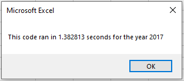
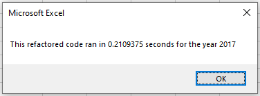
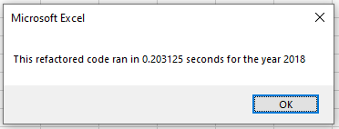

# Stock Analysis with VBA

## Project Overview
This project includes a set of Visual Basic Applications (VBA) code that was written to analyze a given group of stocks. The task at hand is to refactor the VBA code for more efficient execution.

### Purpose
The purpose of this project is to provide the client with a tool, a VBA script that will analyze a set of Wall Street stock and provide information regarding their performance, specifically the Total Daily Volume and the Return for the given years 2017 and 2018.

## Methods
An Excel spreadsheet was provided that contained the trading volume and closing value for a selection of 12 Wall Street stock symbols. The spreadsheet included data for the years 2017 and 2018. VBA code was written to summarize and extract the total volume and the loss/gain data for the selected stocks. Furthermore, a timer was implemented to compare the execution speeds of the two sets of code, Original and Refactored. The elapsed time will be displayed at the end of the analysis via a pop up window.

### Original Code
The original code set was set up as outlined below.
1. An input box was created to capture the desired analysis year.
2. The output headers were created and formatted to include a section header and a header row.
3. Initialized the stock symbols array and assigned each of the twelve symbols to an array element.
4. Prepared for the analysis by initializing the variables for the stock starting price, stock ending price, and the number of total rows in the data set.
5. Created a nested FOR loop to collect the Starting Price, Ending Price, and the Total Volume for each of the desired stocks.
6. The data was written to the output worksheet under the headings created in step 2.
7. Formatted the output data for better readability. 

### Refactored Code
The refactoring was done to the original code to produce a more efficient process for the analysis.  The steps are described in the list below. Steps 1 - 3 were preserved from the original code. Changes were implemented beginning from step 4 onwards.
4. A stock ticker index was created to track the Stock, Starting Price, Ending Price, and the Trading Volume.
5. Created a loop to initialize the total volume per each stock to the value of zero.
6. A second loop was created to loop over the data rows of the full data set of the desired year and collect the starting price, ending price, and the total volumes per each of the stock symbols.
7. Created a loop to output the stock symbol, stock volume, and return on stock under the output headers created under step 2.
8. Formatted the output data for better readability.

## Results

### Numerical Results
As expected, both the Original and Refactored code produced identical numerical results for the traded volumes and return on stocks.

For the year of 2017, the most traded stock within the twelve stocks analyzed was FSLR with a total volume of 684,181,400 which returned a gain of 101.3 percent. The stock with symbol DQ traded a total volume of 35,796,200 with a return of 199.4 percent. On the low end of the scale for return was the stock TERP with a total volume of 139,402,800 stocks traded with a negative return of 7.2 percent.

The 2018-year analysis showed two of the stock ENPH and RUN were the only stock that yielded a positive return. ENPH returned 81.9 percent with a traded volume of 607,473,500 and RUN returned 84.0 percent with a total volume of 502,757,100 in trade.

### Code Performance
When comparing the execution speeds of the Original and Refactored VBA code, it was visibly evident that the refactored code performs better by far. The execution times for the Original and Refactored code is presented below as evidence to the fact.

#### Original
2017 Original Code Performance

2018 Original Code Performance

#### Refactored
2017 Refactored Code Performance

2018 Refactored Code Performance

## Conclusions
The conclusions drawn for this project are...
- The variation in the stock markets is so much that care should be taken in investing in any stock.
- Professional advisors should be sought out before investing in the stock market.
- VBA code can be written in many ways to achieve a given result.
- We should strive to produce code that is effcient in performing the analysis and calculation to the best of our ability.